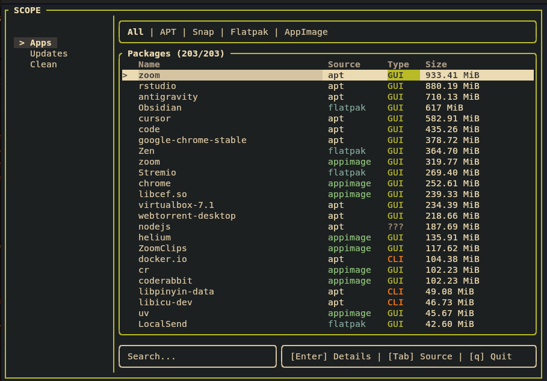

# Scope 🔭

A beautiful terminal user interface (TUI) for managing Linux packages across multiple package managers.


## ✨ Features

- **Multi-Package Manager Support** - Manage packages from:
  - 📦 **APT** (Debian/Ubuntu)
  - 🔶 **Snap**
  - 📱 **Flatpak**
  - 🖼️ **AppImage**

- **Beautiful TUI** - Modern terminal interface with:
  - Retro Warmth color theme (Gruvbox-inspired)
  - Real-time package scanning with streaming updates
  - Clean, minimal design

- **Powerful Package Management**:
  - 🔍 **Real-time search** - Type to filter packages instantly
  - 🗑️ **Uninstall packages** - From the details view
  - 🔄 **Check for updates** - Batch update support

## 📸 Screenshot



## 🗺️ Roadmap

### ✅ Completed
- [x] Package scanning (APT, Snap, Flatpak, AppImage)
- [x] Real-time search
- [x] Uninstall packages (APT, Snap, Flatpak)

### 🚧 In Progress
- [ ] AppImage deletion support

### 📋 Planned
- [ ] Package updates
- [ ] Package installation
- [ ] Clear cache


## ⌨️ Keyboard Shortcuts

### Main View

| Key | Action |
|-----|--------|
| `↑` / `k` | Move up |
| `↓` / `j` | Move down |
| `←` / `h` | Focus sidebar |
| `Enter` | View package details |
| `Tab` | Next source filter |
| `Shift+Tab` | Previous source filter |
| `Home` / `g` | Jump to first |
| `End` / `G` | Jump to last |
| `PageUp` / `PageDown` | Page navigation |
| `Esc` | Clear search / Quit |
| `q` | Quit application |

### Details View

| Key | Action |
|-----|--------|
| `d` | Uninstall package |
| `u` | Update package (if available) |
| `Esc` | Go back to main view |

### Search

Just start typing to filter packages in real-time. Press `Esc` to clear the search.


## 📁 Project Structure

```
scope/
├── Cargo.toml          # Project configuration
├── src/
│   ├── main.rs         # Entry point and event handling
│   ├── app.rs          # Application state management
│   ├── package.rs      # Package data structures
│   ├── theme.rs        # Color theme definitions
│   ├── scanner/        # Package manager scanners
│   │   ├── mod.rs      # Scanner coordinator
│   │   ├── apt.rs      # APT scanner
│   │   ├── snap.rs     # Snap scanner
│   │   ├── flatpak.rs  # Flatpak scanner
│   │   └── appimage.rs # AppImage scanner
│   └── ui/             # User interface components
│       ├── mod.rs      # UI coordinator
│       ├── main_view.rs    # Package list view
│       ├── sidebar.rs      # Navigation sidebar
│       ├── details_view.rs # Package details
│       └── dialogs.rs      # Confirmation dialogs
└── README.md
```

## 🔧 Dependencies

- **[ratatui](https://github.com/ratatui-org/ratatui)** - Terminal UI framework
- **[crossterm](https://github.com/crossterm-rs/crossterm)** - Terminal manipulation
- **[tokio](https://tokio.rs/)** - Async runtime
- **[serde](https://serde.rs/)** - Serialization
- **[fuzzy-matcher](https://crates.io/crates/fuzzy-matcher)** - Fuzzy search
- **[humansize](https://crates.io/crates/humansize)** - Human-readable sizes

## 🤝 Contributing

Contributions are welcome! Please feel free to submit a Pull Request.

1. Fork the repository
2. Create your feature branch (`git checkout -b feature/amazing-feature`)
3. Commit your changes (`git commit -m 'Add some amazing feature'`)
4. Push to the branch (`git push origin feature/amazing-feature`)
5. Open a Pull Request

## 📝 License

This project is licensed under the MIT License - see the [LICENSE](LICENSE) file for details.

## Author 
Khurram Bhutto 
https://github.com/khurrambhutto

