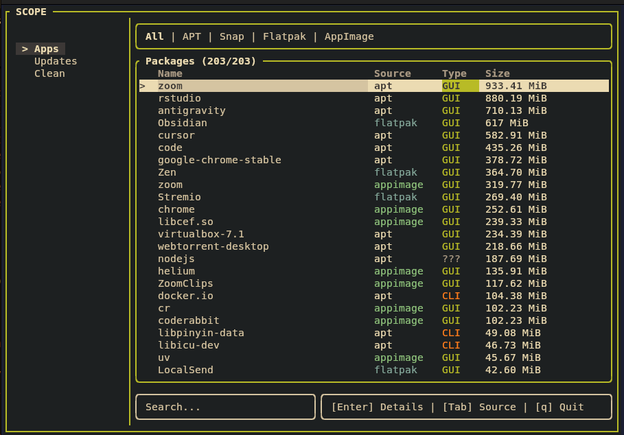

# Scope 🔭

A beautiful terminal user interface (TUI) for managing Linux packages across multiple package managers.


---

## 📸 Screenshot



---

## ✨ Features

- **Multi-Package Manager Support**
  - 📦 **APT** (Debian/Ubuntu)
  - 🔶 **Snap**
  - 📱 **Flatpak**
  - 🖼️ **AppImage**

- **Real-time Search** - Type to filter packages instantly
- **Package Management** - View details, uninstall packages
- **Self-Update** - Built-in update mechanism
- **Beautiful UI** - Modern TUI with smooth navigation

---

## � Usage

```bash
scope                 # Launch the TUI
scope --update        # Check and install updates
scope --check-update  # Check if update available
scope --version       # Show version
scope --help          # Show help
```

---

## ⌨️ Keyboard Shortcuts

### Main View

| Key | Action |
|-----|--------|
| `↑` / `k` | Move up |
| `↓` / `j` | Move down |
| `←` / `h` | Focus sidebar |
| `Enter` | View package details |
| `Tab` | Next source filter |
| `Shift+Tab` | Previous source filter |
| `Home` / `g` | Jump to first |
| `End` / `G` | Jump to last |
| `PageUp/Down` | Page navigation |
| `Esc` | Clear search / Quit |
| `q` | Quit |

### Details View

| Key | Action |
|-----|--------|
| `d` | Uninstall package |
| `u` | Update package |
| `Esc` | Go back |

### Search

Just start typing to filter packages in real-time. Press `Esc` to clear.

---

## 🗺️ Roadmap

### ✅ Completed
- [x] Package scanning (APT, Snap, Flatpak, AppImage)
- [x] Real-time search
- [x] Uninstall packages (APT, Snap, Flatpak, AppImage)
- [x] Self-update mechanism
- [x] Package updates (batch update by source)

### 🚧 Planned
- [ ] Package installation
- [ ] Disk usage overview
- [ ] Cache cleanup

---

## 📁 Project Structure

```
scope/
├── Cargo.toml
├── src/
│   ├── main.rs         # Entry point & CLI
│   ├── app.rs          # Application state
│   ├── package.rs      # Package data structures
│   ├── theme.rs        # Color theme
│   ├── updater.rs      # Self-update logic
│   ├── scanner/        # Package scanners
│   │   ├── mod.rs
│   │   ├── apt.rs
│   │   ├── snap.rs
│   │   ├── flatpak.rs
│   │   └── appimage.rs
│   └── ui/             # UI components
│       ├── mod.rs
│       ├── main_view.rs
│       ├── sidebar.rs
│       ├── details_view.rs
│       └── dialogs.rs
└── README.md
```

---

## 🔧 Dependencies

| Crate | Purpose |
|-------|---------|
| [ratatui](https://github.com/ratatui-org/ratatui) | Terminal UI framework |
| [crossterm](https://github.com/crossterm-rs/crossterm) | Terminal manipulation |
| [tokio](https://tokio.rs/) | Async runtime |
| [clap](https://clap.rs/) | CLI argument parsing |
| [reqwest](https://docs.rs/reqwest) | HTTP client (for updates) |
| [semver](https://docs.rs/semver) | Version comparison |

---

## 🤝 Contributing

Contributions welcome! 

1. Fork the repository
2. Create your feature branch (`git checkout -b feature/amazing-feature`)
3. Commit your changes (`git commit -m 'Add amazing feature'`)
4. Push to the branch (`git push origin feature/amazing-feature`)
5. Open a Pull Request

---

## 📝 License

MIT License - see [LICENSE](LICENSE) for details.

---

## 👤 Author

**Khurram Bhutto**  
GitHub: [@khurrambhutto](https://github.com/khurrambhutto)
