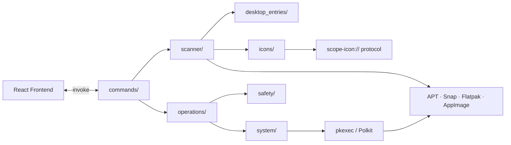

<p align="center">
  
</p>

# Scope

**See, update, and uninstall every app on your Linux system — all in one place.**

Linux users install software from APT, Snap, Flatpak, and AppImage — then have to remember which tool installed what just to remove it. Scope scans all four sources into one list, enriches entries with desktop metadata and icons, and provides a preview-first uninstall/update flow with Polkit privilege escalation. You never type a package-manager command manually.

## Architecture

Tauri v2 (Rust backend + React webview). Frontend calls typed `invoke` commands; backend never runs frontend strings through `sh -c`.


```mermaid
flowchart LR
  Webview["React Frontend"] <-->|invoke| CMDS[commands/]
  CMDS --> SCAN[scanner/] & OPS[operations/]
  OPS --> SAF[safety/] & SYS[system/]
  SCAN --> DE[desktop_entries/] & IC[icons/]
  IC --> PROTO[scope-icon:// protocol]
  SYS --> PK[pkexec / Polkit] --> PM[APT · Snap · Flatpak · AppImage]
  SCAN --> PM
```

- [x] **Parallel scanning** — 4 scanners in `tokio::JoinSet` with per-command timeouts, desktop-entry enrichment on blocking thread pool
- [x] **Preview-then-apply** — Backend issues `OperationPlan` → stores in `PlanStore` (5-min TTL) → frontend sends only `plan_id` to apply → re-scans + revalidates + executes
- [x] **`scope-icon://` protocol** — Custom URI scheme serves resolved icon paths; follows freedesktop.org Icon Theme Spec (`Inherits=` chains, GTK theme detection, hicolor fallback)
- [x] **Safety deny-list** — 40+ system-critical APT packages blocked, Snap runtimes blocked, AppImage path guard with canonicalized root checks

## Tech Stack

| Layer | Stack | Why |
|-------|-------|-----|
| Shell | Tauri v2 (Rust) | Native Linux window, Polkit root access, no Electron |
| Frontend | React 19 + TypeScript 5.8 | Component model, strict-mode type checking |
| Bundler | Vite 7 | Fast HMR, Tauri dev-server integration |
| Async runtime | `tokio` (process, fs, sync) | Parallel scans, per-command timeouts |
| Scanning | `walkdir`, `regex`, `glob` | Filesystem scans, apt output parsing, desktop entry discovery |
| Serialization | `serde` + `serde_json` | All DTOs cross the Rust ↔ JS boundary |
| Self-update | `tauri-plugin-updater` + `tauri-plugin-process` | In-app download, progress bar, restart |
| CI | GitHub Actions | Build `.deb`/`.rpm`/`.AppImage` on tag push |

## Install

**Download:** [GitHub Releases](https://github.com/khurrambhutto/scope/releases) — `.deb`, `.rpm`, `.AppImage`. The app auto-updates itself.

```bash
# Ubuntu / Debian
curl -LO https://github.com/khurrambhutto/scope/releases/latest/download/scope_0.1.6_amd64.deb
sudo dpkg -i scope_0.1.6_amd64.deb
```

**Build from source** (needs `libwebkit2gtk-4.1-dev`, Rust stable, Node 20+):

```bash
sudo apt install libwebkit2gtk-4.1-dev libappindicator3-dev librsvg2-dev patchelf
npm install
npm run tauri dev
```

## Status

- [x] Multi-source scanning (APT, Snap, Flatpak, AppImage) with parallel execution
- [x] Desktop-entry enrichment + freedesktop.org icon resolution
- [x] Uninstall from Scope (all sources, preview-first, pkexec auth, deny-list protected)
- [x] Update from Scope (APT/Snap/Flatpak, preview-first, pkexec auth)
- [x] CI release pipeline builds `.deb`, `.rpm`, `.AppImage`
- [x] Self-updater with in-app notification and progress bar
- [ ] AppImage auto-update (preview shows "not yet implemented")
- [ ] Snap target version display (`snap refresh --list` doesn't report target)
- [ ] AppImage update detection (always reports `has_update: false`)
- [ ] Whole-system cleanup (caches, orphans, leftovers)
- [ ] Disk usage visualization
- [ ] Arch/Fedora package-manager scanner support

## Contributing

Concrete areas needing help:

- **AppImage auto-update** — implement in `operations/update.rs:166`
- **Snap version info** — parse target version from `snap info` in `scanner/snap.rs`
- **Unit tests for operations** — mock `run_elevated`, test preview → revalidate → apply lifecycle
- **Arch/Fedora scanners** — add `scanner/pacman.rs` or `scanner/dnf.rs` using the `Scanner` trait
- **Frontend tests** — Vitest + React Testing Library on `PackageScreen`, `UninstallDialog`, `usePackages`

PRs: keep business logic in domain modules, keep Tauri commands thin, run `npm run build && cargo check --manifest-path src-tauri/Cargo.toml` before submitting.

## License

[MIT](LICENSE)
