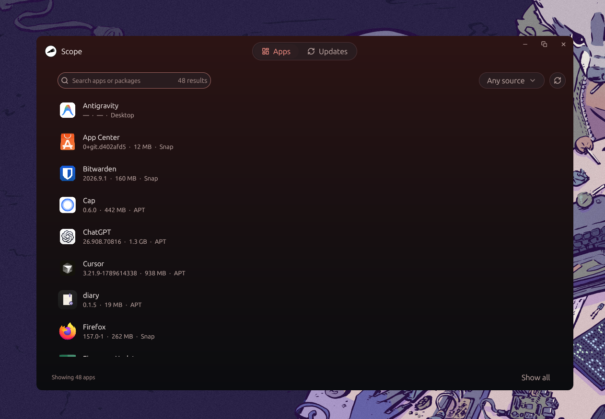

<p align="center">
  
</p>

<h1 align="center">Scope</h1>

<p align="center"><strong>See, update, and uninstall every app on your Linux system in one place.</strong></p>

Linux spreads software across APT, Snap, Flatpak, and AppImage. Scope scans all four into a single list, adds desktop names and icons where a GUI app exists, and lets you update or uninstall without typing a package-manager command. Every destructive action shows a preview first. Privileged actions go through Polkit, so Scope never handles your password.

<p align="center">
  
</p>

Built with Zed's GPUI (Rust binary in `src/`, no webview). Architecture and module rules live in [AGENTS.md](AGENTS.md).

## Install

Download the `.deb` from [GitHub Releases](https://github.com/khurrambhutto/scope/releases). The app checks the Releases API on startup and self-updates (`.deb` via `pkexec dpkg -i`; `.rpm`/AppImage installs and unknown installs fall back to the Releases page).

```bash
# Ubuntu / Debian
sudo apt install ./scope_<version>_amd64.deb
```

Build from source (Rust stable; Linux needs GPUI system deps, notably `libxkbcommon-x11-dev`):

```bash
sudo apt install libxkbcommon-x11-dev
cargo run
```

## How it works

The main window lists every user-relevant package with its source, version, size, and update state. Search or filter by source and GUI/CLI, then select a row for full details.

Update and uninstall follow the same flow. Scope builds a plan showing exactly what will run and waits for your confirmation. The backend then revalidates the package against the live system and executes. Commands that need root trigger the standard system password dialog. System-critical packages are deny-listed in the backend and cannot be removed through Scope.

## Status

Works today:

- Unified package list across APT (manual installs), Snap (runtimes hidden), Flatpak (user and system scoped), and AppImage (listed only)
- Desktop-entry enrichment and freedesktop icon theme resolution
- Uninstall with preview, Polkit auth, and a protected-package deny-list
- Update with preview for APT, Snap, and Flatpak
- Self-updater banner (checks GitHub Releases, one-click install for self-updatable installs)
- Release pipeline producing `.deb` (Ubuntu first)

Not yet:

- `.rpm` and `.AppImage` release artifacts (installs of those kinds fall back to manual download)
- AppImage uninstall and update (AppImages are listed only)
- Snap target version in the update preview
- Whole-system cleanup and disk usage views
- Fedora and Arch package-manager support

## Development

```bash
cargo run
cargo check
cargo test
cargo clippy
```

Run all three checks before submitting. Safety-sensitive backend changes need targeted Rust tests first.

Good first contributions are AppImage auto-update (`src/domain/operations/update.rs`), Snap target versions (`src/domain/scanner/snap.rs`), `.rpm`/AppImage release artifacts (`.github/workflows/release.yml`), and new scanners through the `Scanner` trait (`src/domain/scanner/`).

Keep feature logic in domain modules; `main.rs` and `app_view.rs` only compose and wire, `backend.rs` stays a thin orchestration layer. PRs welcome.

## License

[MIT](LICENSE)
